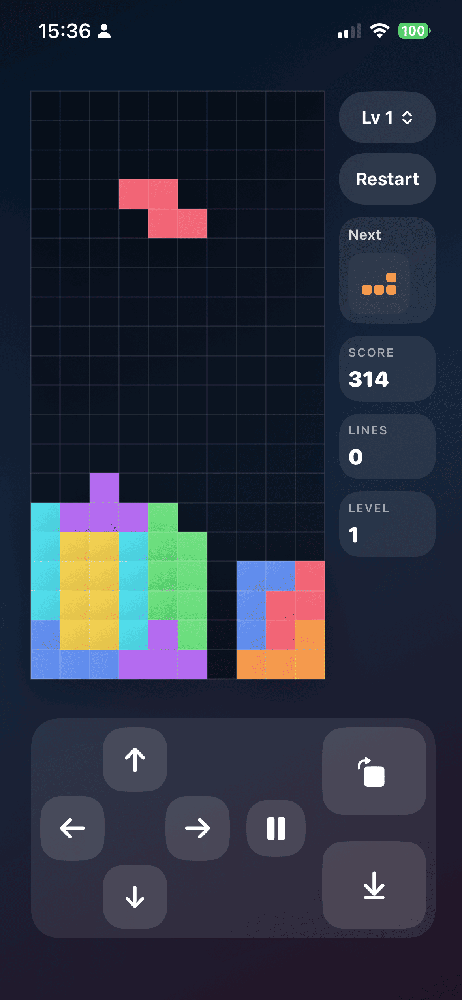

# LGTetris

A classic Tetris game built with SwiftUI, designed for iPhone and iPad.

## Features

- All 7 standard tetrominoes with a 7-bag randomizer
- Progressive difficulty — speed increases every 10 lines cleared
- Selectable starting level (1–10)
- Soft drop (hold) and hard drop
- Next piece preview
- Score tracking with standard line-clear multipliers (100 / 300 / 500 / 800 × level)
- Sound effects for moves, rotations, line clears, and game over
- Adaptive layout for both compact (iPhone portrait) and regular (iPad / landscape) screen sizes
- Pause / resume support

## Controls

### Compact layout (iPhone portrait)

| Input | Action |
|---|---|
| ← / → | Move left / right |
| ↑ | Rotate clockwise |
| Hold ↓ | Soft drop |
| Hard drop button | Instantly drop piece |
| Pause button | Pause / resume |

### Regular layout (iPad / landscape)

On-screen buttons for left, right, rotate, soft drop, and hard drop are shown alongside the board.

## Scoring

| Lines cleared | Points |
|---|---|
| 1 | 100 × level |
| 2 | 300 × level |
| 3 | 500 × level |
| 4 (Tetris) | 800 × level |

Soft drop adds 1 point per row; hard drop adds 2 points per row.

## Requirements

- iOS 17+ / iPadOS 17+
- Xcode 15+

## Building

Open `LGTetris/LGTetris.xcodeproj` in Xcode, select a simulator or device, and hit Run.

## License

See [LICENSE](LICENSE).
